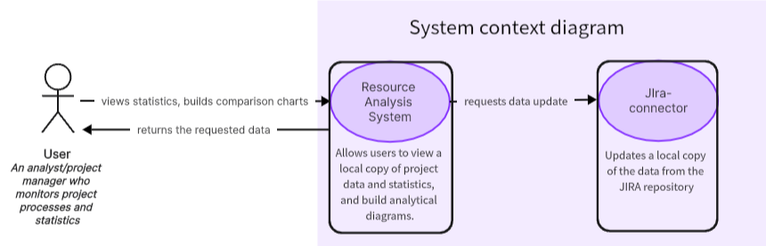
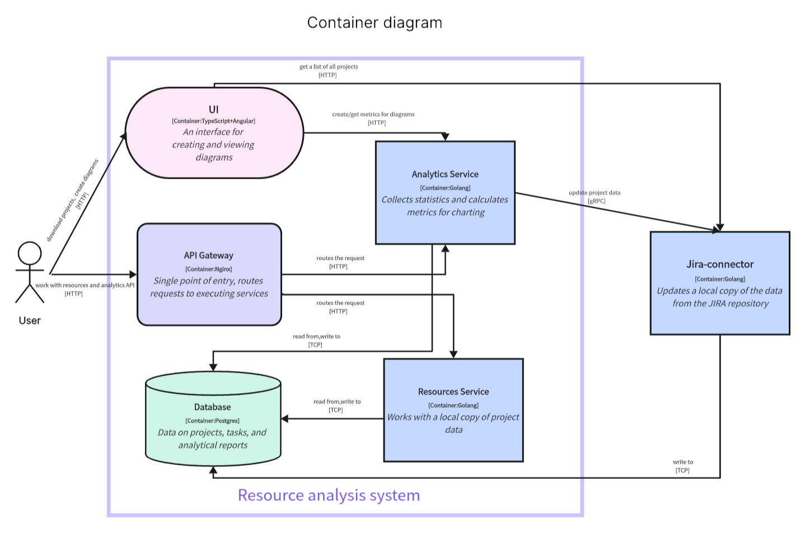
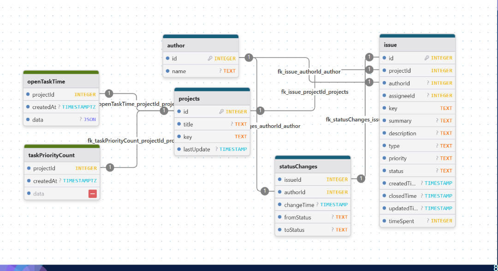

# JIRA-analyzer

## Collaborators

* *Дудкина София Сергеевна 5130904/30104*
* *Козакова Анна Алексеевна 5130904/30104*

## Problem Definition

Командам, работающим с Jira, трудно быстро и сопоставимо получать метрики по задачам: данные разбросаны по десяткам Jira-проектов, стандартные отчёты неполные и неудобны для агрегации. Из-за этого тратится много времени на ручные выгрузки, метрики считаются по-разному, а сравнение проектов получается неточным.

## Development Of Requirements

1.	Как аналитик/PM, хочу создать локальную копию данных Jira выбранных проектов в Postgres, чтобы работать с консистентными данными без лимитов и задержек Jira.
2.	Как пользователь, хочу видеть “сухую” статистику по проекту (общее число задач; открытые/закрытые/переоткрытые/разрешённые; “In progress”; среднее время выполнения; среднее число заведённых задач/день за последнюю неделю), чтобы быстро оценить состояние проекта.
3.	Как аналитик, хочу строить диаграммы по проекту (например, гистограмма времени, которое задачи были в состоянии “open” или распределение по статусам/приоритетам), чтобы видеть динамику и узкие места процесса.

### Estimating The Number Of Users

* Сервис ориентирован на средние и крупные IT-компании.
* Предполагается, что им пользуется порядка 50 компаний.
* В каждой компании около 1000 пользователей Jira, из которых 40 % хотя бы раз в день заходят в аналитику → 50 × 1000 × 0,4 ≈ ***20 000*** активных пользователей в день.

### Estimating The Data Retention Period

Для аналитики по задачам Jira исторические данные важны:
* сравнение эффективности команд год к году;
* анализ длительных проектов;
* требования аудита и compliance в крупных компаниях.

Период хранения ***7 лет*** полный жизненный цикл большинства долгих проектов и удовлетворяют типичные требования бизнеса и аудита.

## Architecture Development And Detailed Design

### Service Load
#### Initial Assumptions
* Активные пользователи: 20 000 уникальных пользователей в сутки.
* Запросы к сервису: в среднем 50 запросов на пользователя в день
→ ~1 000 000 запросов/сутки.
* Средний RPS: ≈ 12 RPS (1 000 000 / 86 400), пиковый ×5 → ~60 RPS.
* Период хранения данных: 7 лет.
* Новые данные в день:
  * ~5 000 новых задач
  * ~25 000 событий по задачам

#### Read/Write Correlation
Пользовательская работа — это в основном просмотр дашбордов и метрик. Запись — это загрузка/обновление данных проекта, сохранение аналитики.

Всего ~1 000 000 запросов/день:
* Чтение (R): ~85 % → 850 000 запросов/сутки
* Запись (W): ~15 % → 150 000 запросов/сутки

Средние значения:
* Reads: 850 000 / 86 400 ≈ 10 RPS (пик до 50 RPS)
* Writes: 150 000 / 86 400 ≈ 2 RPS (пик до 10 RPS)

#### Traffic volumes

Ответы API порядка нескольких Кб, для расчетов возьмем в среднем 5 КБ. 1 000 000 ответов × 5 КБ ≈ 5 ГБ исходящего трафика в сутки. Запросы пользователей меньше, входящий траффик порядка 1 ГБ в сутки.

#### Disk System Capacity

1 запись в issue ~ 1 Кб, в author, projects, statuschanges ощутимо меньше ~ 0.2 Кб

30000 * 365 * 7 ≈ 77 млн записей * среднее 0.6 Кб ≈ 45 ГБ сырых данных + ~30% аналитических данных ≈ 59 Гб

С учётом индексов, резервов, служебных данных ×2–3: ~ 200 Гб

### Diagrams


### API
Сервис JIRA Analyzer предоставляет REST-API, которое используется веб-интерфейсом(не все handlers).
Web доступен по http://localhost:80 . API всех сервисов доступно по http://localhost:8080.

[GET] `/api/v1/connector/projects` 

Получение списка доступных проектов из репозитория Jira.  
Параметры для пагинации и фильтрации:

- `limit` - количество проектов на странице.
- `page` - номер страницы, для которой мы хотим получить список проектов.
- `search` - параметр для фильтрации проектов по имени и ключу.

не более 500 мс

```json
{
  "Projects": [
    {
      "Id": 0,
      "Key": "",
      "Name": "",
      "Url": "",
      "Existence": false
    }
  ],
  "PageInfo": {
    "currentPage": 0,
    "pageCount": 0,
    "projectsCount": 0
  }
}
```

- `PageInfo` необходимо для того, чтобы пагинация в UI корректно работала.
- `currentPage` - номер страницы, для которой мы получили список проектов.
- `pageCount` - общее количество страниц, которое должно получиться при заданном параметре “limit”.
- `projectsCount` - общее количество доступных для загрузки проектов.

[POST] `/api/v1/connector/updateProject/{projectKey}` 

Обновление (или скачивание) проекта по его ключу.

при скачивании нового проекта среднее время выполнения запроса 25 секунд (время напрямую зависит от количества данных)

[GET] `/api/v1/projects` 

Получение всех загруженных проектов.

Параметры для пагинации:

- `limit` - количество проектов на странице.
- `offset` - двиг от начала.

не более 500 мс

Тело ответа:

```json 
{
  "_links": {
    "histories": [
      { "href": "string" }
    ],
    "issues": [
      { "href": "string" }
    ],
    "projects": [
      { "href": "string" }
    ],
    "self": {
      "href": "string"
    }
  },
  "data": [
    {
      "Id": 0,
      "Key": "",
      "Name": ""
    }
  ]
}
```

[GET] `/api/v1/projects/{id}` 

Получение сухой статистики проекта по его ID в БД.

не более 500 мс

Тело ответа:

```json
{
  "Id": 0,
  "Key": "",
  "Name": "",
  "allIssuesCount": 0,
  "openIssuesCount": 0,
  "closeIssuesCount": 0,
  "resolvedIssuesCount": 0,
  "reopenedIssuesCount": 0,
  "progressIssuesCount": 0,
  "averageTime": 0,
  "averageIssuesCount": 0
}
```

[DELETE] `/api/v1/projects/{id}` 

Удаление проекта из БД по его ID.

не более 500 мс

[GET] `/api/v1/histories/by-author/{authorId}`

Получить историю изменений, сделанных конкретным автором.

не более 500 мс

```json
{
  "_links": {
    "histories": [
      { "href": "string" }
    ],
    "issues": [
      { "href": "string" }
    ],
    "projects": [
      { "href": "string" }
    ],
    "self": {
      "href": "string"
    }
  },
  "data": {}
}
```

[GET] `/api/v1/histories/by-issue/{issueId}`

Получить историю изменений конкретной задачи.

не более 500 мс

```json
{
  "_links": {
    "histories": [
      { "href": "string" }
    ],
    "issues": [
      { "href": "string" }
    ],
    "projects": [
      { "href": "string" }
    ],
    "self": {
      "href": "string"
    }
  },
  "data": {}
}
```

[GET] `/api/v1/issues/by-project/{projectId}`

Получить список задач проекта.

Параметры для пагинации:

- `limit` - количество проектов на странице.
- `offset` - двиг от начала.

не более 500 мс

```json
{
  "_links": {
    "histories": [
      { "href": "string" }
    ],
    "issues": [
      { "href": "string" }
    ],
    "projects": [
      { "href": "string" }
    ],
    "self": {
      "href": "string"
    }
  },
  "data": {}
}
```

[GET] `/api/v1/issues/{id}`

Получить задачу по ID.

не более 500 мс

```json
{
  "_links": {
    "histories": [
      { "href": "string" }
    ],
    "issues": [
      { "href": "string" }
    ],
    "projects": [
      { "href": "string" }
    ],
    "self": {
      "href": "string"
    }
  },
  "data": {}
}
```

[GET] `/api/v1/graph/get/{taskNumber}` 

Получение данных по аналитической задаче с номером taskNumber для проекта.

Параметры:
- `project` - ключ проекта.

не более 500 мс

```json
[
  {
    "count": 0,
    "time": "" 
  }
]
```

[POST] `/api/v1/graph/make/{taskNumber}` 

Проведение аналитической задачи с индексом taskNumber для проекта.

Параметры:
- `project` - ключ проекта.

не более 10 с

```json
[
  {
    "count": 93,
    "time": ""
  }
]
```

[DELETE] `/api/v1/graph/delete` 

Удаление всех аналитических задач для проекта.

Параметры:
- `project` - ключ проекта.

не более 500 мс

[GET] `/api/v1/isAnalyzed` 

Получение информации о том, проведена ли хотя бы одна аналитическая задача для проекта.

Параметры:
- `project` - ключ проекта.

не более 500 мс

```json
true
```

[GET] `/api/v1/compare/{taskNumber}` 

Получение данных по аналитической задаче с индексом taskNumber для нескольких проектов.

Параметры:
- `project` - ключи проектов, через запятую

не более 10 с

```json
[
  {
    "key": "",
    "data": [
      {
        "count": 93,
        "time": ""
      }
    ]
  }
]
```

### Database



Основные сущности (projects, issue, author, statusChanges) разнесены по отдельным таблицам, связи выражены через INTEGER-FK. На этих полях создаются B-tree индексы. Типичные GET-запросы выполняются через index scan по ограниченному диапазону строк и занимают минимальное количество времени. Таблицы openTaskTime и taskPriorityCount хранят уже посчитанные агрегаты по проекту и времени, что позволяет избежать тяжелых пересчетов метрик.

### Scaling Up The Service

Исходно система рассчитана на ~20 000 активных пользователей в сутки.
При росте до ~200 000 пользователей в сутки (≈10× RPS) сохраняются те же нефункциональные требования по времени отклика (до 500 мс) за счёт горизонтального масштабирования контейнеров и разделения чтения/записи в БД.

**Горизонтальное масштабирование**

* UI разворачивается на нескольких инстансах, чтобы выдерживать рост количества запросов.
* API Gateway (Nginx) — 2 экземпляра за L7-балансировщиком (с нагрузкой справится и 1, но ради отказаустойчивости 2), масштабируются по RPS/CPU.
* Analytics Service — пул экземпляров, которые независимо обрабатывают запросы на аналитические данные.
* Resources Service — также масштабируется горизонтально; каждый экземпляр работает с общей БД.
* Jira-connector — несколько экземпляров для параллельной синхронизации данных с Jira.

**Балансировка нагрузки**

* Входящий HTTP-трафик распределяется через внешний Load Balancer между экземплярами API Gateway.
* API Gateway балансирует запросы между экземплярами Analytics Service и Resources Service по алгоритму round-robin / least-connections.

**Масштабирование базы данных**

* Основная БД масштабируется вертикально (увеличение ресурсов) и горизонтально по чтению:

  * один Primary-сервер для операций записи;
  * несколько Read Replica для операций чтения (подавляющие количество запросов - GET).

* При необходимости включается партиционирование таблиц по проекту/времени.

### Build
`run.sh` собирает приложение, запускает unit-тесты, интерграционные тесты и приложение.
При сборке докер образа запускается unit-тестирование. Если unit-тесты не проходят - приложение не собирается.
Покрытие unit-тестами:


Интеграционные тесты описывают 2 сценария:
1) Запрос к api по `/api/v1/connector/projects` с заданнымы параметрами и проверка соответствия возвращаемых данных этим параметрам.
2) Запрос к api по `/api/v1/connector/updateProject/{projectKey}` с заданным ключем проекта. Проект должен быть загружен в БД. Далее отправляется GET запрос `/api/v1/projects`, и проверяется, что загруженный ранее проект есть в базе данных и возвращается сервисом resourses в списке загруженных проектов.

После прохождения тестов поднимается приложение с помощью docker-compose.
